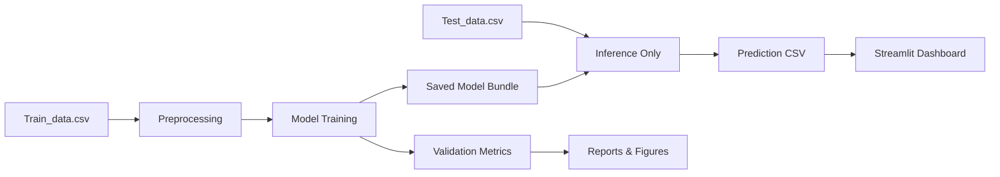

# PS40 - AI-Powered Network Intrusion Detection System

[](https://www.python.org/)
[](https://scikit-learn.org/)
[](https://streamlit.io/)
[](https://www.ibm.com/)

## Overview

This project implements a production-style intrusion detection pipeline for the IBM AICTE internship problem statement PS40. It classifies TCP/IP connections as `normal` or `anomaly` using a reusable scikit-learn workflow and presents the result in a cybersecurity-themed Streamlit dashboard.

The repository is structured for GitHub submission, VS Code editing, and easy extension into a LangFlow + IBM Granite narrative.

## Problem Statement

Network traffic must be classified quickly and reliably so suspicious connections can be separated from normal activity. This project uses supervised machine learning to detect intrusion patterns in connection records and support a lightweight security review workflow.

## Why It Matters

Intrusion detection is a common cybersecurity control because it helps flag malicious or abnormal traffic early. In a lab or internship setting, the goal is not only to predict well, but also to show a clear engineering workflow, reproducible training, and a usable demo for stakeholders.

## Dataset

The project uses the provided `Network Intrusion Detection` CSV files. Each row represents a TCP/IP connection with 41 features.

- `Train_data.csv` contains labeled examples for model training and validation.
- `Test_data.csv` is used for prediction export and demo scoring.
- The target label is normalized into two classes: `normal` and `anomaly`.

## Key Features

- End-to-end data pipeline for NSL-KDD style CSV files
- Missing value handling, label normalization, encoding, and scaling
- Model comparison across Random Forest, Gradient Boosting, and Logistic Regression
- Automatic handling of unlabeled test CSV files
- Exportable prediction CSV with probabilities
- Saved artifacts for model, encoders, scaler, and metrics
- Dark-themed Streamlit cybersecurity dashboard
- IBM AICTE-compatible LangFlow and Granite alignment documents

## Demo Assets

- Sample input CSV: `demo/sample_input.csv`
- Sample output CSV: `demo/sample_predictions.csv`
- Validation figures: `screenshots/confusion_matrix.png`, `screenshots/roc_curve.png`, `screenshots/feature_importance.png`
- Quick demo guide: `quick_demo.md`

## Folder Structure

```text
network-intrusion-detection-ai/
├── app/
├── data/
├── docs/
├── langflow/
├── models/
├── notebooks/
├── reports/
├── screenshots/
├── src/
├── main.py
├── README.md
├── requirements.txt
└── run.bat
```

## Architecture



See [docs/architecture.md](docs/architecture.md) for the full design narrative.

## Installation

```bash
python -m pip install -r requirements.txt
```

On Windows, the batch file also works:

```bat
setup.bat
```

## Usage

### Train the model

```bash
python -m src.train_model
```

### Run prediction on a CSV file

```bash
python -m src.predict --input data/raw/Test_data.csv --output reports/predictions.csv
```

### Launch the dashboard

```bash
streamlit run app/streamlit_app.py
```

### Generate the presentation

```bash
python build_presentation.py
```

## Results

The current training baseline typically reaches near-perfect validation performance on the provided dataset. The exact metrics are written to `reports/metrics.json` after training.

On the latest validated run, the best model was Random Forest with validation accuracy of `0.9976`, F1 score of `0.9978`, and ROC AUC of `1.0000`.

## Generated Outputs

The training pipeline produces the following deliverables:

- `reports/metrics.json` - validation metrics and model comparison summary
- `reports/predictions.csv` - scored output for the unlabeled test set
- `reports/figures/confusion_matrix.png` - class-level validation error breakdown
- `reports/figures/roc_curve.png` - ROC curve for the best model
- `reports/figures/feature_importance.png` - top features ranked by the tree-based model

## Screenshots

The main evaluation plots are already copied into `screenshots/` for portfolio use.

- [Confusion Matrix](screenshots/confusion_matrix.png) - shows how many normal and anomaly rows were classified correctly or incorrectly.
- [ROC Curve](screenshots/roc_curve.png) - shows how well the model separates the two classes across thresholds.
- [Feature Importance](screenshots/feature_importance.png) - shows which input features influenced the Random Forest most.

Add any extra UI screenshots here before submission.

## IBM AICTE Alignment

This solution is framed as an ML intrusion detection engine with an Agentic AI layer that can explain threats through IBM Granite and LangFlow orchestration. The codebase includes a project narrative, workflow documentation, and a deck structure that match the internship format.

## Future Improvements

- Add real-time packet streaming
- Extend to multiclass attack classification
- Add explainability views for security analysts
- Connect the model to a SOC-style alerting workflow

## Demo Workflow

1. Install dependencies: `py -3 -m pip install -r requirements.txt`
2. Train the model: `py -3 -m src.train_model`
3. Launch the dashboard: `py -3 -m streamlit run app/streamlit_app.py`
4. Upload `demo/sample_input.csv`
5. Download the scored output from the dashboard or use `demo/sample_predictions.csv`

## Contribution Guide

1. Fork the repository.
2. Create a feature branch.
3. Commit focused changes.
4. Open a pull request with a clear description.

## License

Released under the MIT License. See [LICENSE](LICENSE).
