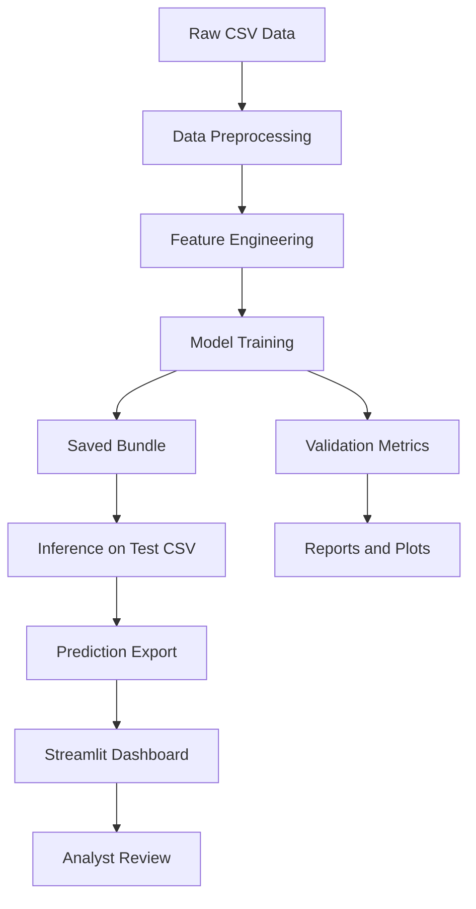

# Architecture

## System Overview

The project is organized as a layered intrusion detection solution:

1. CSV ingestion and dataset validation
2. Preprocessing and feature preparation
3. Multi-model training and validation
4. Model bundle persistence
5. Batch inference on unlabeled traffic
6. Streamlit-based analytics dashboard

## Mermaid Diagram

## IBM / Agentic AI Narrative

The ML model acts as the detection core. In the IBM-aligned narrative, LangFlow orchestrates a lightweight agent pipeline that retrieves model output, and an IBM Granite-based explanation agent summarizes threats in plain language for a security analyst.

## Deployment View

- Train offline in VS Code or a batch script
- Save the bundle to `models/`
- Serve predictions through Streamlit
- Export reports to `reports/figures/`
