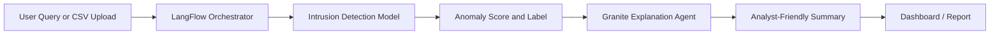

# LangFlow + Granite Agent Workflow

## Purpose

This project is modeled as a hybrid ML + Agentic AI solution:

- The machine learning engine detects intrusion probability.
- LangFlow orchestrates the flow between steps.
- IBM Granite explains the detected threat in plain English.

## Pseudo Workflow

## Agent Roles

1. Detection Agent: scores a connection or batch of connections.
2. Explanation Agent: describes why the traffic is suspicious.
3. Reporting Agent: formats the result for dashboard or document output.

## IBM Alignment Notes

The implementation can remain local and model-driven while still presenting an IBM-ready architecture narrative. This is sufficient for the internship submission format when live Granite credentials are not being used.
